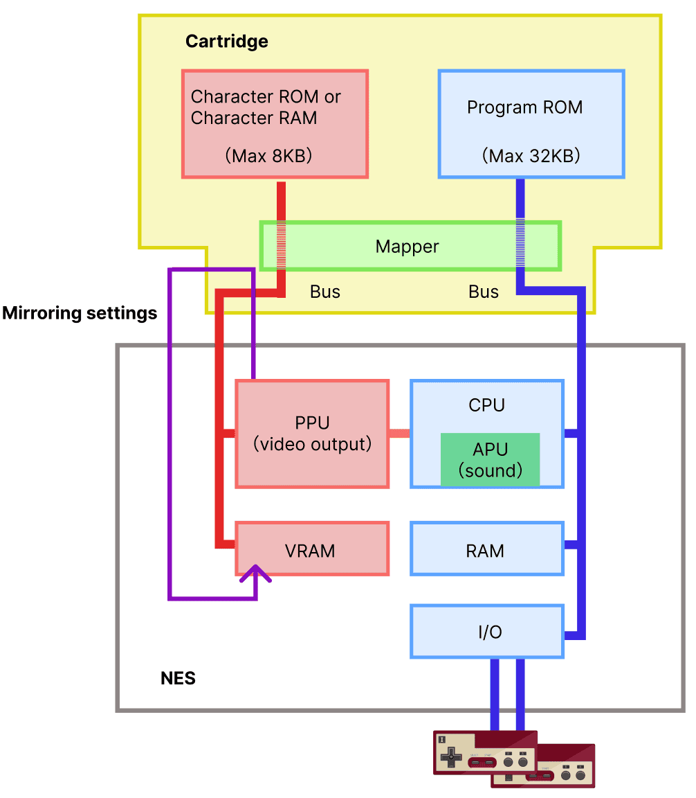

# カートリッジ

カートリッジには
- プログラムROM
- キャラクターROM
  2つのメモリーを内蔵。
  キャラクターのメモリーには
  ROMとRAMの2種類。
  ROMはデータがあらかじめ書き込まれている。

RAMは電源投入時はデータが空。
プログラム実行中にプログラムROMからデータをRAMにコピーすることになる。
プログラムROMはCPUのバスに接続されている。
キャラクターROMまたはRAMはPPUのバスに接続されている。

両者のバスは独立していてつながっていない。
このため、CPUからPPU側に直接アクセスすることはできなく、PPUを経由して間接的にアクセスする。

カートリッジは様々あり、回路「バンク切り替え」
（メモリー容量を増やす機能）は、
回路にデコード用のICが追加されている。
バッテリバックアップを備えたソフトは
SRAMと電池が追加されている。
他に音源用チップや演算用のチップを乗せているソフトもある。

このような拡張性の高さが、ファミコンの人気が長く続いた理由の１つ。
