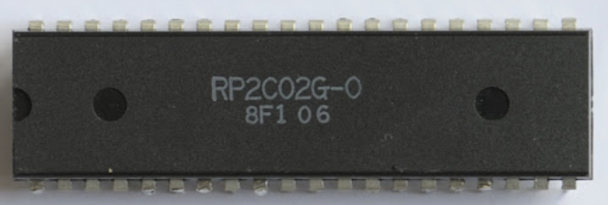

# PPU 2C02

グラフィック処理を管理するＰＰＵ(Picture Processing Unit)で、リコー社によってファミコン向けに新規開発された

- スプライトのサイズは1枚あたり8x8ピクセル
- スプライトは最大64枚同時表示可能
- スプライト用の「タイル」（画像）は「パターンテーブル」という領域に256種類まで登録可
- タイルはスプライトやBG用の8x8ピクセルの画像のこと

当時の家庭用ゲーム機としてはずば抜けて高性能だった
